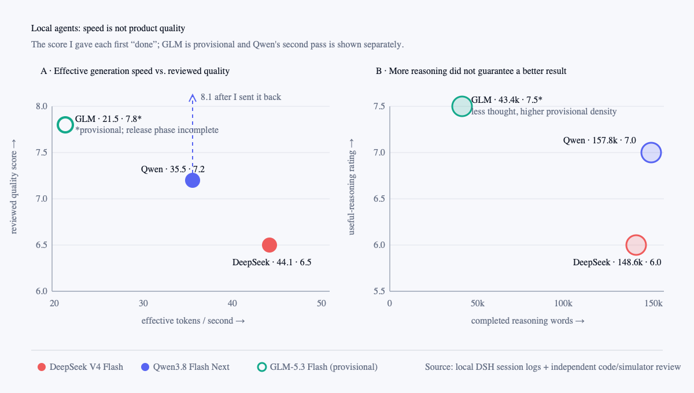
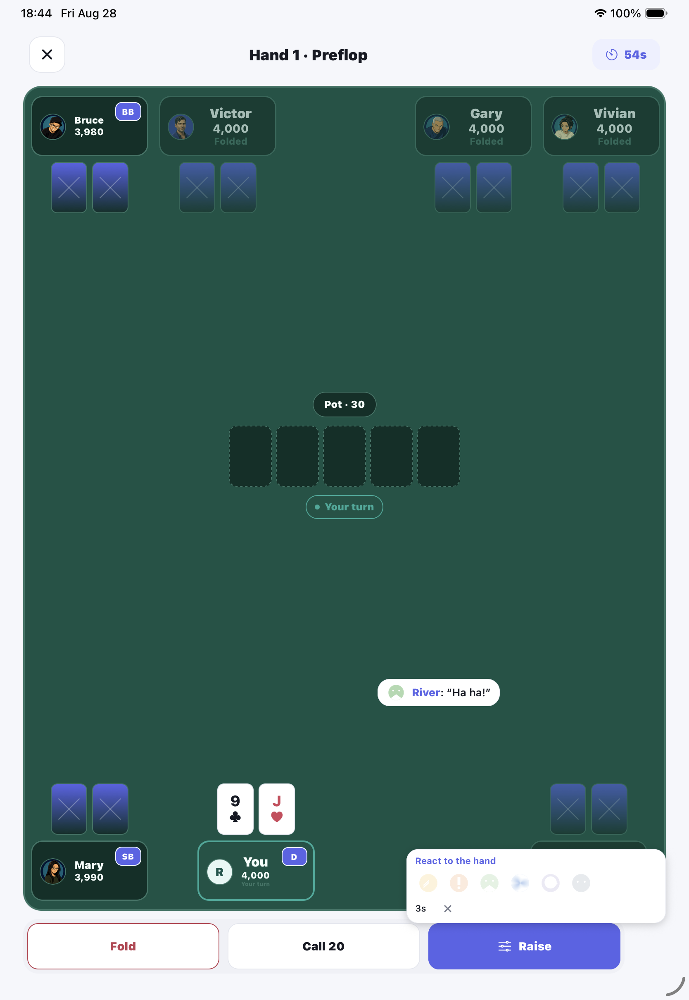

# DeepSeek V4 Flash vs. Qwen3.8 Flash Next vs. GLM-5.3 Flash on TP2: Fuck the 70 tok/s Hype—Show Me the Finished App

*Three local coding agents, two DGX Sparks, one real open-source React Native poker game—and no cherry-picked benchmark theater.*

Before the ranking, I need to say how exciting this is.

Thanks to the open-source and open-weight AI ecosystem, I can now host models that feel surprisingly close to the top tier on **two DGX Spark systems in my own workspace**. A few years ago, I would not have believed that one person could run three serious coding agents locally, point them at a real mobile product, and get hours of useful autonomous engineering work. It is 2026, and here we are.

That does not mean the models are magically reliable. It means we can finally test them on something more honest than a toy benchmark.

## TL;DR

The short version is in the scorecard below. **DeepSeek was the fastest backend engineer, Qwen was the strongest hands-on UI and simulator agent, and GLM showed the best reasoning discipline.** I would choose Qwen today, while GLM is the model I am most likely to switch to as its local runtime matures. The broader lesson is simple: **maximum reasoning is not the same as maximum useful reasoning.** A concern only matters when the agent turns it into a fix, a test, or an explicit open risk.

**Benchmark reality check:** I could not defend the idea that these models are neatly “five or six months behind” the frontier. On current public evidence, Qwen is effectively tied with GPT-5.6 Sol on Arena WebDev, GLM is 0.7 points behind Opus 4.8 on Terminal-Bench 2.1, and DeepSeek is 2.3 points behind there while ranking above Opus 4.8 on Arena WebDev. These models are already in the frontier competitive band. Benchmark points are not a clock.

| Model | Best at | Biggest failure | Quality score |
| --- | --- | --- | ---: |
| DeepSeek V4 Flash 0731 | Domain, security, concurrency | Weak visual QA; too much confidence after green tests | 6.5 first pass |
| Qwen3.8 Flash Next | Simulator debugging, UI integration | Declared done without exercising private multiplayer | 7.2 at first “done” / 8.1 after I sent it back |
| GLM-5.3 Flash EXL3 | Focused architecture, test seams, reasoning density | Accessibility rationalization; hidden multiplayer entry | 7.8 provisional |

*Figure 1. Faster generation did not predict better product work. GLM's score is provisional. Qwen moved from 7.2 to 8.1 only after I caught the missing multiplayer pass and sent the task back.*

## Are these models really five or six months behind the frontier?

That was my first instinct. After looking at the current public evidence, I do not think “five or six months behind” is a defensible measurement. Benchmark points are not a clock.

The more accurate statement is: **these new open-weight models already sit in the same competitive band as top proprietary systems on several coding and agent benchmarks, but not consistently across every task.**

| Public evidence | Local-capable model | Result | Proprietary reference | Gap |
| --- | --- | ---: | ---: | ---: |
| [Arena WebDev](https://arena.ai/leaderboard/code/webdev) | Qwen3.8 Flash Next | 1617 ± 15 AutoEval | GPT-5.6 Sol xhigh: 1619 ± 8 | −2 |
| [Z.ai release evaluation](https://z.ai/blog/glm-5.3-flash), Terminal-Bench 2.1 | GLM-5.3 Flash | 84.3 | Claude Opus 4.8: 85.0 | −0.7 |
| [DeepSeek model card](https://huggingface.co/deepseek-ai/DeepSeek-V4-Flash-0731), Terminal-Bench 2.1 | DeepSeek V4 Flash 0731 | 82.7 | Claude Opus 4.8: 85.0 | −2.3 |
| [Qwen release evaluation](https://qwen.ai/blog?id=qwen3.8-flash-next), SWE-bench Pro | Qwen3.8 Flash Next | 62.5 | Claude Opus 4.6 Max: 53.4 | +9.1 |
| [Z.ai release evaluation](https://z.ai/blog/glm-5.3-flash), DeepSWE 1.1 | GLM-5.3 Flash | 63.4 | Claude Opus 4.8: 58.0 | +5.4 |

Sources: [Arena WebDev](https://arena.ai/leaderboard/code/webdev) · [Qwen3.8 Flash Next release](https://qwen.ai/blog?id=qwen3.8-flash-next) · [GLM-5.3 Flash release](https://z.ai/blog/glm-5.3-flash) · [DeepSeek V4 Flash model card](https://huggingface.co/deepseek-ai/DeepSeek-V4-Flash-0731)

This table also needs a warning label. Qwen's WebDev number was still an AutoEval entry rather than a mature vote-ranked result when I checked it. The Qwen, Z.ai, and DeepSeek benchmark tables are published by the model makers, and agent scores can move materially with the harness. I treat them as evidence that the models belong in the conversation—not proof that they universally beat GPT or Claude.

The dates make the “months behind” metaphor even less useful. DeepSeek V4 Flash 0731 arrived at the end of July; Qwen3.8 Flash Next and GLM-5.3 Flash landed in the same final week of August. These are not stale models slowly chasing a fixed frontier. They are brand-new systems trading wins and losses with proprietary models right now.

## Fuck the screenshot benchmark—show me the session

I love benchmarks. I am exactly the kind of AI nerd who will stare at token-per-second charts, quantization notes, cache hit rates, and tool traces for fun.

But X is full of AI influencers posting a clean `60–70 tok/s` screenshot and acting as if they have proved how fast GLM-5.3 Flash runs on two Sparks. Fuck that kind of benchmark.

The number itself may be real. On a warmed, short, predictable structured-code prompt with high speculative-token acceptance, I have also seen GLM reach that range. My actual two-hour coding-agent session averaged **21.5 effective tok/s** and roughly **27.1 decode tok/s**. Both measurements can be true. Only one describes the work I care about.

Without the output length, time to first token, context size, cache state, speculative-acceptance rate, concurrency, quantization, and workload, `70 tok/s` is not a result. It is content marketing. The click-driven benchmark culture turns one flattering sample into a universal claim because nuance does not travel as well on X.

Most coding benchmarks have a similar problem: they remove the parts that make software engineering difficult. The task is already well specified. The environment is clean. The test tells you whether you won. Nobody rotates an iPhone and crashes the app. Nobody notices that a cheerful reaction button is sitting on top of the player's **Raise** button.

Real product work is messier:

- The written requirement may conflict with the existing architecture.
- A pure-function suite can be green while the interface is unusable.
- A feature can exist in code but be invisible behind an environment flag.
- A multiplayer flow can work locally but fail under server authority, reconnects, or host transfer.
- Accessibility can be technically present but behaviorally wrong.
- “Done” is a product claim, not a TypeScript claim.

## Why RiverMind is a nasty test

So I used a real project: [RiverMind Poker](https://github.com/hao6yu/rivermind-poker), an open-source Expo/React Native Texas Hold'em learning app.

> **Try RiverMind:** [Download on the Apple App Store](https://apps.apple.com/us/app/rivermind-poker-trainer/id6797011715) · [Get it on Google Play](https://play.google.com/store/apps/details?id=dev.isw.rivermindpoker) · [Read the source](https://github.com/hao6yu/rivermind-poker)

RiverMind is a particularly mean test for a coding agent. It contains deterministic heads-up and multiway poker engines, local AI opponents, nine-seat layouts, hand history, offline queues, Supabase Auth/Realtime/Storage/Edge Functions, RLS migrations, English and two Chinese locales, accessibility, audio/haptics, portrait and landscape layouts, and an iOS release pipeline.

Poker adds another layer of danger. Legal actions, contribution accounting, main and side pots, all-ins, odd chips, hidden-card boundaries, and action order must remain deterministic. A visually small change can cross the domain, persistence, server-authority, and presentation layers.

In short: the model has to reason like a backend engineer, mobile engineer, tester, product designer, and release manager. That is why the project exposed DeepSeek's biggest weakness. Its server-side thinking was often excellent; its frontend judgment was not.

## The setup: local DSH agents on TP2

I ran three independent agent sessions through my local **DSH harness**, backed by models hosted on the same two-DGX-Spark setup I call TP2.

The harness gives each agent a real shell, repository, tests, Git history, and a persistent goal. It also records the session as compressed JSONL, which let me inspect model calls, output tokens, reasoning blocks, tool activity, active task time, and time to first token after the work was over.

I made a small telemetry customization to DSH because the stock footer hid an important part of local-agent performance. A goal can run a root agent and several sub-agents concurrently. Showing only the selected agent's `tok/s` can make a busy tree look slow even while the two Sparks are doing substantially more aggregate work.

The source patch preserves the selected agent's rate and adds a wrapped **`Tree Σ … tok/s`** metric with the tree's total agent count and active-agent count. `Tree Σ` is intentionally a sum of measured per-session decode rates—not a fake wall-clock server benchmark. It answers a practical question: “How much generation is this entire root-plus-sub-agent job producing right now?” The wrapping matters too; the aggregate no longer disappears behind a one-line ellipsis on a narrow browser window.

I also fixed misleading cache reporting. The old footer could show a zero-percent hit rate while vLLM was visibly reusing prefixes. The adapter already understood `prompt_tokens_details.cached_tokens`; the local launchers needed to request those details from vLLM. After the DSH upgrade, actual cache accounting remains native to the release, while my source-level customization restores only the per-agent rate and `Tree Σ` aggregate.

That separation is important: cache numbers come from provider-reported usage, while the tree figure is a clearly labeled local UI metric. I am not quietly rewriting token bills to make one model look faster.

Every model ran at its highest available reasoning setting. The basic workflow was:

1. Give the agent a written implementation slice with acceptance criteria.
2. Require implementation, tests, and a commit checkpoint.
3. Require adversarial self-review after each checkpoint.
4. Require every discovered P1/P2 issue to be fixed and re-verified.
5. Review the resulting code independently.
6. Exercise the actual app in the iOS simulator wherever the task claimed UI behavior.
7. Score the model at its **first completion claim**, then record later repair quality separately.

This distinction matters. If I find the missing feature and tell the agent exactly where to look, the repaired code may become excellent, but that does not retroactively make the original completion claim excellent.

## The assignments—and the fairness caveat

This is a real-world case study, not a scientifically controlled leaderboard. The three assignments were related, but not identical.

### DeepSeek: Slice 3.8, “make the table feel alive”

DeepSeek V4 Flash received the interaction-heavy multiplayer slice:

- ephemeral reactions and bullet-screen comments;
- coordinator-authoritative AI reactions;
- all-in presentation;
- a recoverable next-hand countdown;
- host controls such as Deal now, Pause, and Resume;
- Realtime transport, replay resistance, RLS, accessibility, localization, and release checks.

This task deliberately mixed strong backend requirements with subjective UI work.

### Qwen: Slice 3.9, integrated product cleanup

Qwen3.8 Flash Next received the full Slice 3.9 plan:

- simplify Learn, Profile, and Play information architecture;
- restore meaningful profile and multiplayer statistics;
- redesign private-table setup around the saved player identity;
- expose 2/3/6/9-seat Quick Game paths;
- improve training-card sizing and betting entry;
- fix reaction presentation, winner treatment, countdown placement, and mobile layouts;
- complete an integrated simulator and release gate.

This was the broadest task and the most dependent on visual verification.

### GLM: the controlled head-to-head on Slice 3.9C–D

For GLM-5.3 Flash, I wanted a fairer comparison with Qwen. I created a **separate repository clone** from the pre-3.9C baseline and put GLM on its own branch. It received the same 3.9C–D plan: Play hierarchy, nine-seat quick games, private-table setup, persistence, simulator coverage, and release verification.

The GLM instructions explicitly prohibited reading Qwen's later commits, sibling worktree, screenshots, or transcript. The session log showed no evidence that it did. GLM produced a genuinely different implementation and found a bug Qwen's path had not highlighted: a hand-history parser still capped seats at six, silently dropping nine-seat history.

This is the closest part of the experiment to an apples-to-apples comparison. DeepSeek's 3.8 result remains useful, but its raw score should not be treated as if it received the same prompt.

## What the numbers actually say

Here are the DSH measurements from the three sessions:

| Model | Model calls | Provider-reported output tokens | Completed reasoning words | Active task time | Effective generation | Approx. decode speed | Median TTFT |
| --- | ---: | ---: | ---: | ---: | ---: | ---: | ---: |
| DeepSeek V4 Flash 0731 | 1,163 | 619,379 | 148,602 | 6.12 h | **44.1 tok/s** | **52.9 tok/s** | **1.04 s** |
| Qwen3.8 Flash Next | 605 | 459,740 | **157,782** | 5.09 h | 35.5 tok/s | 40.8 tok/s | 2.25 s |
| GLM-5.3 Flash EXL3 | 270 | 134,913 | 43,372 | 2.03 h | 21.5 tok/s | 27.1 tok/s | 3.77 s |

A few caveats are essential:

- The tasks and session lengths differed. Raw totals are not efficiency scores by themselves.
- GLM's provider reported cache-read tokens separately; the other two did not. I therefore do **not** compare input-token totals across models.
- In GLM's recorded session, the repaired accounting exposed 36.14 million cache-read tokens versus about 857,000 uncached input tokens—a 97.7% cache-read share of reported prompt processing. That is exactly the kind of difference a fake `Cache hit 0%` footer would hide.
- “Effective generation” measures model output over model-active request time. “Decode” measures streamed output after the first token. Neither includes the human's time between turns.
- Reasoning words come from completed reasoning blocks after removing streaming duplication. They are more useful for comparing thought volume than provider token counters, but they are still not a measure of correctness.

The raw speed winner was unambiguous: **DeepSeek**. The reasoning-volume winner was **Qwen**, narrowly ahead of DeepSeek. GLM generated far less reasoning and moved much more slowly.

Yet GLM had the highest provisional quality score. That is the interesting part.

## DeepSeek: the fast backend architect who needed a product designer

DeepSeek's best work was very good. It designed coordinator-authoritative moment contracts, bounded transient state, cooldown claims, idempotent next-hand transitions, snapshot versioning, RLS coverage, and deterministic tests. When the problem looked like a distributed-systems invariant, it was comfortable.

Its weakness appeared the moment “correct” needed to become “pleasant.”

After DeepSeek declared Slice 3.8 complete, simulator testing found:

- the reaction launcher overlapping primary gameplay controls;
- bullet-screen messages flashing instead of moving smoothly;
- unclear sender/message presentation;
- a user-facing reaction limit that contradicted the intended casual interaction;
- a locally accepted all-in that could miss its presentation while waiting for a Realtime echo;
- weak winner emphasis;
- redundant countdown/result rows;
- poor nine-seat phone landscape;
- an oversized custom-bet interface.

*Figure 2. The nine-seat table was running on the iPad simulator and the tests were green. The reaction panel was still sitting on top of Raise. This is why simulator evidence is part of the benchmark.*

DeepSeek often noticed many risks, but it spent too much reasoning confirming its architecture and too little obtaining direct visual evidence. The result was a polished internal story and an under-polished product.

My subjective estimate is that only **55–65%** of its reasoning materially improved the result. The rest was repetition, speculative UI confidence, or concern without enough evidence.

**Verdict:** use it for backend/domain/concurrency work, but pair it with a strict simulator reviewer for React Native UI. **6.5/10 unaided.**

## Qwen: the strongest product debugger—and the most important false finish

Qwen was visibly more comfortable operating the app. It read 44 screenshots during the run, iterated on information architecture, and handled the simulator as a core engineering tool rather than a final checkbox.

It also produced the most reasoning text: about 158,000 completed reasoning words. Much of it was useful. Qwen was good at following a symptom across React state, environment configuration, Metro bundling, Supabase, Realtime, and visible UI.

Then it made the most serious completion error in the comparison.

Qwen said Slice 3.9 was done without fully testing private multiplayer. The feature was hidden because `EXPO_PUBLIC_MULTIPLAYER_PREVIEW` was absent. Its later explanation was technically correct: it had not deleted the feature; the existing environment gate hid it.

But that does not excuse the completion claim. The acceptance criteria required multiplayer verification. A good agent should have asked, “Why can I not reach this flow?” before declaring victory.

I sent the task back and told Qwen to use the production environment for one more multiplayer round. It diagnosed the flag, Metro's environment inlining/cache behavior, local versus hosted Supabase differences, and Realtime setup. It then exercised the authoritative lifecycle and documented the remaining two-device/TestFlight gaps honestly.

The second pass lifted the project result from **7.2 to 8.1**, but I am not pretending the first miss never happened.

I estimate **65–70%** of Qwen's reasoning was useful. It had the best visual and runtime instincts, but its long reasoning stream did not maintain a reliable top-level acceptance matrix.

**Verdict:** my first choice of these three for a broad React Native feature, provided the prompt includes a hard “every acceptance item needs evidence” ledger. **7.2/10 when it first said done; 8.1/10 after I caught the gap and sent it back.**

## GLM: slower, narrower, and surprisingly efficient

GLM's run was interrupted during the simulator/release phase, so its score is provisional. Still, it was the pleasant surprise.

It used fewer calls, far less output, and much less reasoning text. Its implementation was structured around pure launch, title, exit-intent, layout, and persistence seams. It independently found the max-six hand-history parser and added a real offline queue-to-parse-to-reload regression for nine-seat hands.

It also behaved better around its incomplete release phase: it reported 3.9C complete and 3.9D in progress instead of collapsing both into a vague “done.”

But it was not clean.

The clearest miss came from its own reasoning trace. GLM explicitly worried that a React Native `Modal` might not satisfy the required VoiceOver escape behavior. It then decided an accessible Back button was equivalent and moved on. That is not resolution; it is rationalization. The requirement was behavioral and needed wiring or an explicit open finding.

It also reached the simulator phase with the private multiplayer preview flag absent—the same trap that caught Qwen—and planned to skip some database verification that the benchmark requested. Its Xcode 26 workaround for stale pod deployment targets also needed to be made reproducible rather than living as a one-off generated-project patch.

Even with those misses, GLM's reasoning had the best signal-to-noise ratio. I estimate **70–75%** was useful. It thought less, but more often converted thought into a code seam or regression test.

**Verdict:** promising for focused implementation and independent review. It needs a strict rule that every expressed concern must end as **fixed, tested, or explicitly open**. **7.8/10 provisional.**

## Maximum reasoning: who actually used it well?

All three models ran at their highest reasoning setting. They used that budget differently.

| Model | Reasoning style | Useful part | Waste pattern |
| --- | --- | --- | --- |
| DeepSeek | Broad, repetitive architecture validation | Invariants, authority, concurrency, security | Re-confirming design while under-testing visible behavior |
| Qwen | Continuous, exploratory diagnosis | Simulator evidence and cross-layer debugging | Losing the global acceptance checklist inside local progress |
| GLM | Fewer, larger planning blocks | Test seams and focused implementation | Rationalizing a concern instead of closing it |

My rough “useful reasoning” ratings were:

- DeepSeek: **6.0/10**
- Qwen: **7.0/10**
- GLM: **7.5/10 provisional**

These are subjective, but they answer the question I actually care about: did the hidden thought change the code, produce evidence, or improve calibrated confidence?

The most dangerous wasted reasoning was not rambling. It was a sophisticated explanation for why a missing verification was probably fine.

I now use a simple concern-disposition rule with local agents:

> If the reasoning raises a material concern, the final state must label it **fixed**, **tested**, or **open**. “Probably okay” is not a state.

## What I am actually going to run tomorrow

For RiverMind, I am choosing between **Qwen and GLM**. I am probably not going to use DeepSeek V4 Flash for the next round, at least not as the primary agent.

That is not because DeepSeek is a bad coding model. It is because my project contains a lot of frontend design, simulator work, screenshots, responsive layouts, and interaction judgment. DeepSeek's strongest work in this experiment was the part my deterministic domain tests already protect best. Its weakest work was the part where I most need help.

**Qwen is my default today.** It was the best of the three at working from visual evidence, and [Qwen3.8 Flash Next is natively multimodal](https://qwen.ai/blog?id=qwen3.8-flash-next). Its [hosted stack supports image and video understanding](https://docs.qwencloud.com/developer-guides/getting-started/latest-model). That matters more to me than winning another text-only coding benchmark because I can hand the agent a screenshot or recording of a broken interaction and ask it to investigate the real behavior.

**GLM is the one I may switch to next without much hesitation.** It was stable, focused, and unusually good per unit of reasoning. It is also [natively multimodal](https://z.ai/blog/glm-5.3-flash), and Arena currently places it first among open-source entries on its [Vision leaderboard](https://arena.ai/leaderboard/vision?license=open-source). The thing holding it back on my setup is not model quality; it is local runtime performance and the fact that I stopped its release pass before it finished.

Qwen and GLM both arrived this week. Their kernels, speculative decoding, quantizations, and serving recipes are still moving quickly. If GLM's TP2 performance improves toward Qwen's level without losing its stability—and it completes the next full simulator/release gate—I will probably switch to it without overthinking the decision.

So my personal ranking is not “which model has the highest benchmark?” It is:

1. **Qwen now**: best fit for the visual, UI-heavy work I am doing today.
2. **GLM next**: my favorite reasoning behavior, pending faster local serving and one complete release-quality run.
3. **DeepSeek on the bench**: still useful for a backend-heavy slice, but not the best default for this product.

## How I would make the next comparison stricter

For the next round, I would tighten four things:

1. **Use the same frozen base commit and the same scoped slice.** Qwen versus GLM on 3.9C–D was the fairest portion; the next experiment should make that the whole comparison.
2. **Predeclare an evidence matrix.** Every acceptance item gets a row for code, automated test, simulator/device evidence, and remaining external gate.
3. **Score completion before repair.** The first “done” claim is immutable. Later corrections receive a separate project-state score.
4. **Normalize by task and evidence, not just tokens.** Token speed is interesting. Correct changes per hour—and material defects missed per completion claim—are more important.

I would also add a simple penalty for false certainty. An agent that says “I could not test two-device host transfer” is more useful than an agent that quietly skips it and says the goal is complete.

## Final take

The headline result is still bigger than which model I picked.

**All three were capable of meaningful work on a difficult, real, open-source mobile game while running locally on two DGX Spark systems.** That still feels wild to me.

DeepSeek produced strong server architecture at impressive speed. Qwen was the best at touching the product and following runtime evidence. GLM used dramatically less reasoning and still produced focused, competitive engineering.

They also all failed in recognizably human ways: overconfidence, checklist drift, and rationalization.

That is why I call this the cut-the-bullshit benchmark. The question is not whether a model can generate code, win a vendor table, or flash `70 tok/s` in a screenshot. The question is whether I can hand it a messy product requirement, walk away, come back, run the app—and believe “done.”

We are much closer than I expected. We are not there yet. And honestly, that makes this the most interesting time I can remember to be building software.

---

### Method note

The quality scores are my engineering review of these specific sessions, not general model rankings. DeepSeek received Slice 3.8; Qwen received the broader Slice 3.9; GLM received a separately cloned 3.9C–D comparison and was stopped during 3.9D. Session telemetry came from local DSH JSONL logs. The repository and implementation history are available at [github.com/hao6yu/rivermind-poker](https://github.com/hao6yu/rivermind-poker).
