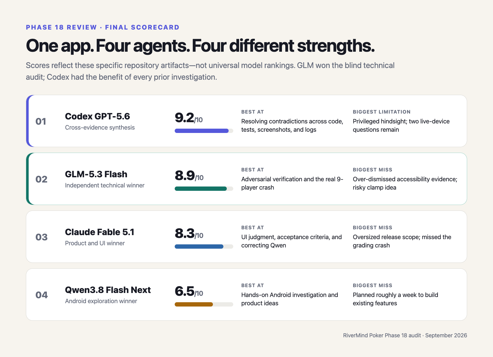
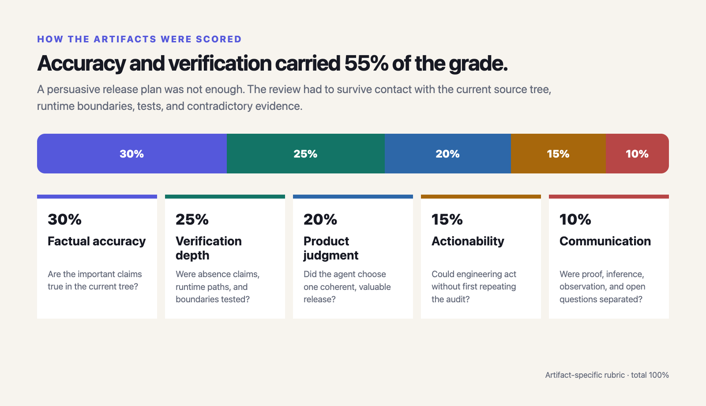
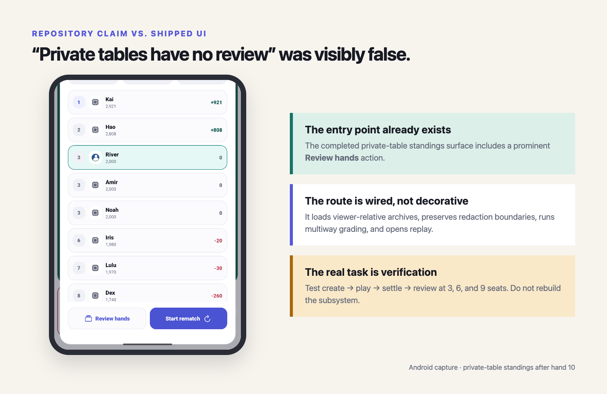
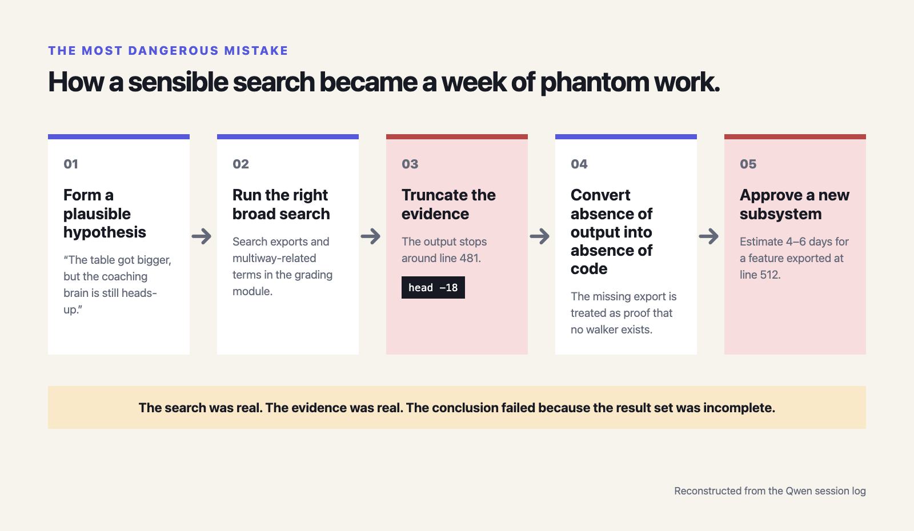
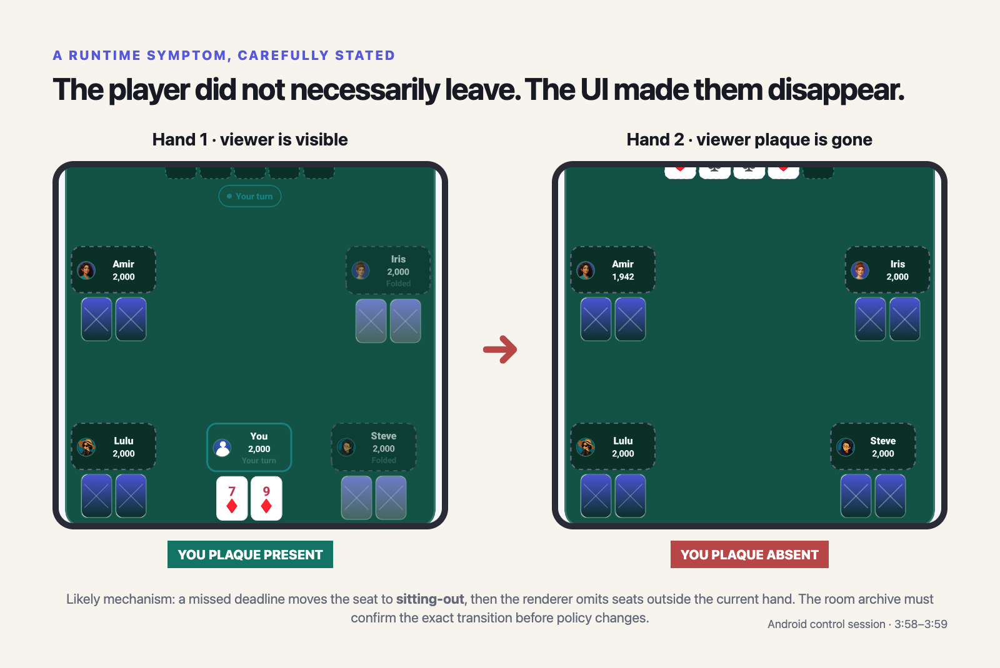
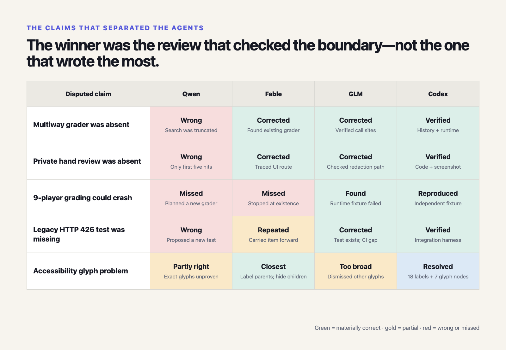
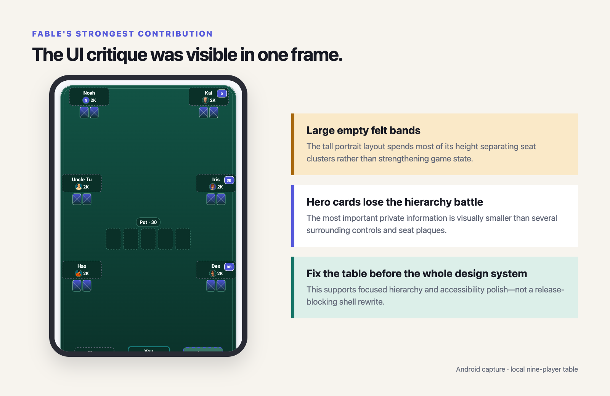

# Claude Fable 5.1 Just Dropped—So I Let Four AI Models Argue Over My Poker App

*I asked Qwen3.8 Flash Next to plan my next release. Claude Fable 5.1 tore the plan apart. GLM-5.3 Flash found a real crash. Then Codex GPT-5.6 graded everyone's homework—including its own.*


*Four AI agents, one poker app, and the confidence of people who did not have to ship it. AI-generated editorial illustration.*

This started as ordinary release planning and became a new-model experiment a few hours later.

RiverMind Poker 1.1 was waiting for store approval, which meant I had reached every indie developer's favorite stage: finding more work before the current work was even approved.

I had been running Qwen3.8 Flash Next locally and had started trusting it with real development work—a milestone that feels perfectly normal until you say it aloud. So I asked it to inspect the product, drive the Android build, investigate anything suspicious, and draft the next release.

Qwen did real work. It built the app, operated the simulator, explored multiplayer, took screenshots, challenged a few assumptions, and eventually produced a long, confident Phase 18 plan.

A few hours later, Claude Fable 5.1 released. This was inconvenient for my afternoon and excellent for the experiment. Instead of waiting for other people's benchmarks, I handed Fable Qwen's plan and asked it to review the findings, challenge anything questionable, and add a serious frontend pass.

Fable came back saying that some of Qwen's biggest findings were not real.

That was awkward. I had already pushed Qwen to confirm several of them more than once.

So I brought in GLM-5.3 Flash, the slower model I tend to trust on coding details. Because when two AI agents disagree about whether a feature exists, the rational response is apparently to invite a third AI agent.

Finally, I asked Codex GPT-5.6 to inspect all three documents, read the agents' session logs, reproduce the disputed findings, check the screenshots and accessibility tree, and score everyone—including itself. A completely normal and unbiased thing to ask an AI.

What followed was not a neat leaderboard. It was four very capable models disagreeing not only about priorities, but about what code existed.

Qwen said RiverMind's learning loop was still heads-up-only and proposed building a new multiway grader. Fable said that grader already existed. GLM agreed with Fable, then found a 9-player crash inside the existing grader that neither earlier model had noticed.

The result is more interesting than “Model A beat Model B.” It became a small case study in how capable coding agents fail: not necessarily by inventing random identifiers, but by collecting real evidence, accidentally hiding part of it, and drawing a confident conclusion from what remained on screen.

## TL;DR



*GLM won the independent technical audit. Codex ranked highest after receiving all three prior investigations and their session logs.*

Among the three independent source agents, **GLM won the technical audit**. Fable was the strongest product designer. Qwen was the strongest exploratory Android operator, but its final plan was not safe to approve.

The Codex score is not directly comparable: it received all three documents and their logs. Its job was synthesis with privileged hindsight, not a blind first attempt.

## Before anyone turns this into a benchmark war

This was not a clean benchmark, and pretending otherwise would be fun but dishonest. The prompts and tools were different, so these scores apply to the artifacts produced in this repository—not to the models in every coding task.

- **Qwen3.8 Flash Next, xhigh reasoning** received the broadest job. It reviewed the product, built and drove Android, investigated multiplayer, took screenshots, corrected its own findings over several user follow-ups, and drafted the original plan. It also used a subagent.
- **Claude Fable 5.1, xhigh reasoning** first received a UI/UX scoping task, then was asked to challenge and merge Qwen's plan. It launched three read-only audit agents and produced the largest document by far.
- **GLM-5.3 Flash, max reasoning** received the narrowest prompt: verify that Qwen's Phase 18 claims were real and not guessed. It worked without subagents and wrote a findings report rather than a full product redesign.
- **Codex GPT-5.6, xhigh reasoning** received every prior artifact plus the instruction to independently investigate and compare them.

I scored each result on five dimensions:



*Accuracy and verification carried 55% of the grade. A persuasive plan was not enough if its premise failed against the current source tree.*

The repository was frozen at commit `121338d2`. The final audit read all three documents and the relevant agent sessions, checked git history and source call sites, inspected the September 1 Android screenshots and raw `uiautomator` dumps, reproduced the disputed 9-player crash, and reran the project gates. Typecheck passed; **183 test files and 1,925 tests passed**.

## First problem: Qwen planned a feature I already had

This was the uncomfortable part: Qwen's Phase 18 thesis was genuinely good.

> Release 1.1 made the table bigger, but the coaching brain was still built for two players.

That would have been an excellent release theme—if it had been true. I could easily have approved it, which is the sentence in this article that should make engineering managers sweat.

The current code already contains `gradeMultiwayHand` in [`decisionGrading.ts`](https://github.com/hao6yu/rivermind-poker/blob/master/src/domain/poker/decisionGrading.ts). It was added on August 2, well before this review. It consumes saved decision context including position, players behind, opponent count, limpers, raise count, raiser position, initiative, equity, and tournament pressure.

It is not dead code. It is wired into:

- the local multiway table's completed-hand and mission reports;
- multiway hand replay;
- session history and summary through a record-mode selector;
- private-table archives after they are converted into viewer-relative multiway records.

The seat engine also already maps positions for two through nine players. Qwen's proposed “fail-before” UTG fixture would not fail before implementation; the basic behavior is already there.

The second central claim—“private tables have no review at all”—was also false. The private session standings already show **Review hands**, load the viewer's server archives, preserve the archive's redaction boundary, route the result through the multiway grader, and replay it through the multiway modal.



*The private-review subsystem did not need to be invented. It needed boundary testing at 3, 6, and 9 seats.*

Qwen budgeted 4–6 days for a new multiway grader and another 3–4 days for private-table review. Those were not small wording errors. They made roughly half of the release's headline implementation phantom work.

## How Qwen missed it: the answer was on line 512, but the search stopped early

This is where one tiny terminal convenience became surprisingly expensive. The session log explains the mistake unusually well.

Before writing the plan, Qwen searched `decisionGrading.ts` for exports and multiway-related terms. But the command ended with:

```text
... | head -18
```

In plain English, `head -18` means **“show me only the first 18 lines of this output.”** It is a normal way to keep a noisy terminal result short. In this case, it quietly removed the evidence that would have disproved Qwen's theory.

The output stopped around line 481. `gradeMultiwayHand` is exported at line 512.

The truncated output still contained pieces of the internal multiway decision function—`hero.position`, `context.position`, and other hints—but not the final export. Qwen then concluded that only the “hand walker” was missing and immediately wrote a plan whose first required slice was a new `gradeMultiwayHand`.

The private-review miss had the same shape. Qwen searched for review entry points, piped the result through `head -5`, saw the heads-up `SessionSummaryModal` hits, and cut off the later multiplayer hits. It treated the first five matches as the complete repository state.

This is more instructive than a random hallucination. The model used the right general tool, found real code, and then confused **truncated output** with **negative evidence**.

The failure pattern was:

1. Form a plausible product hypothesis.
2. Run a broad text search.
3. Truncate the results for convenience.
4. See only evidence that fits the hypothesis.
5. Turn “not visible in the first page” into “does not exist.”



*The search was real and the evidence was real. The conclusion failed because the result set was incomplete.*

Absence claims are expensive. “I did not see it” is never enough when the proposed work is to create a new subsystem.

## Then GLM found the crash hiding inside the feature that “didn't exist”

Fable proved Qwen's missing feature was already there. GLM then did the less glamorous and more valuable thing: it asked whether the existing feature actually worked at nine players.

The answer is: not always.

`gradeMultiwayHand` uses a saved equity estimate when one exists. If it does not, the grader falls back to `estimateFieldEquity`. That estimator explicitly rejects more than five unknown opponents.

In a nine-player hand, a hero postflop decision can have eight live opponents.

GLM built a temporary runtime fixture: nine players called preflop, checked down, and stored no hero equity metadata. The first hero postflop decision had:

```text
opponentCount: 8
estimatedEquity: undefined
```

The grader threw:

```text
Equity requires one to five unknown opponents.
```

The Codex audit independently recreated that fixture and observed the same exception.

This is reachable in shipped code:

- **Private nine-seat review:** multiplayer coordinator actions do not attach saved equity metadata, so review falls back to the estimator.
- **Competitive local modes:** mission and championship paths deliberately suppress live hero equity, creating the same fallback condition.

The bug will not affect every nine-seat hand; enough opponents may fold before the relevant decision. But the path is real, deterministic, and inside the exact surface the Phase 18 plan was supposed to strengthen.

GLM deserves most of its score for finding this. It did not stop at “the function exists.” It tested the boundary created by two independently reasonable constraints: nine-player engine support and a five-opponent equity sampler.

Its suggested fix needs refinement, though. Clamping eight opponents to five would prevent the exception but silently grade the wrong field. Better options are:

1. extend the public-information estimator to support up to eight opponents and measure the device cost;
2. introduce an explicitly labelled bounded approximation that preserves the original opponent count as context; or
3. return an ungraded-but-diagnostic result rather than crash.

For a coaching product, a visible “not enough evidence” state is better than a confident grade calculated against the wrong number of players.

## Meanwhile, the table creator appeared to vanish

Qwen's Android work found the most dramatic runtime story. One private-table session completed ten hands with the creator finishing third at exactly 2,000 chips and zero net change. The creator had apparently hosted a poker game and then achieved the rare strategic line of participating in none of it.

Qwen initially described this as a room starting without its creator even though only the creator can press Start.

The user challenged that interpretation. Qwen went back to the code and corrected itself.

`canStartMultiplayerSnapshot` requires every human seat to be ready and online. The “Waiting for players” lobby copy Qwen had used as evidence was a static row, not a state report. The client therefore did not support the original theory.

The remaining evidence was still real: the session did not visibly wait for creator actions, and the creator's accounting stayed untouched.

Fable then found the most likely mechanism. One missed deadline on an online human seat sets that seat to `sitting-out`. Sat-out seats are not dealt into the next hand. The table renderer only draws seats present in `hand.players`, so the viewer's plaque disappears. The Return action exists, but only in the between-hands panel.

The screenshots support this interpretation. In the later control session, the viewer appears in hand 1 with “Your turn”; by hand 2, the plaque is gone. A 45-second automation delay is enough to trigger the policy.



*The visual defect is confirmed. The likely sit-out mechanism still needs the affected room archive before anyone changes coordinator policy.*

This is probably not a coordinator race. It is likely a valid sit-out transition presented as if the player vanished.

But “probably” matters. The affected room archive was not available in the repository audit. The correct action is exactly what the final combined plan says: read the archive's `participation`, missed-turn, and timeout records before changing worker policy. Regardless of the archive result, the client-side defect is real: the viewer's own seat and the way back should remain visible.

Qwen gets credit here. Its first explanation was wrong, but it responded well to concrete pushback, disproved its own theory, and rewrote the plan around a repro rather than defending the original story.

## The accessibility dispute: all three models had part of the truth

Qwen claimed icon glyphs were reaching TalkBack as private-use Unicode characters with no meaningful labels. GLM rejected the claim because the three exact codepoints Qwen named did not appear in the checked-in dumps and because every clickable table control had a useful `content-desc`. Fable took the middle position: clickable controls were labelled, but glyph-only text nodes were still exposed and should be hidden.

The raw Android tree settles it:

- All **18 of 18 clickable controls** on the captured nine-player table have meaningful labels such as “Leave table,” “Switch to landscape,” “Fold,” “Call 20,” and “Open table feed.”
- The same tree contains **seven private-use glyph text nodes** as non-clickable children of those controls.
- The three exact glyph values cited by Qwen are not the seven found in this capture.

So:

- Qwen's structural concern was real, but “TalkBack announces garbage across the table” was not demonstrated.
- GLM correctly disproved the exact evidence but overreached when it treated labelled parents as proof that no glyph nodes existed.
- Fable's recommendation was the most precise: keep the parent labels, hide decorative glyph descendants, and verify actual behavior with TalkBack and VoiceOver.

This is a good example of why a UI tree is evidence, not the entire assistive-technology experience.

## The small checks that made the ranking less subjective

Several details mattered because they revealed verification discipline.



*The most valuable reviewer was the one that checked runtime boundaries and corrected its evidence model—not the one that produced the longest plan.*

### The legacy-lane regression test already exists

Qwen proposed adding a test proving old protocol traffic receives HTTP 426 from the legacy multiplayer worker. Fable carried that item into its consolidated scope.

GLM checked the integration harness and found the test already present in [`multiplayerLifecycleHttp.test.ts`](https://github.com/hao6yu/rivermind-poker/blob/master/src/services/__tests__/multiplayerLifecycleHttp.test.ts). The actual gap is that the harness is intentionally excluded from the fast default suite and is not run by CI.

The correct task is **CI wiring**, not writing the test.

### Qwen's statistics claim was substantially correct

Qwen said `PlayStatistics` had no spot, position, street, or per-100-hand aggregate. Fable “corrected” this by pointing to session focus areas and concept-improvement trends.

Those aggregates exist, but they do not refute Qwen's narrower statement. They summarize learning concepts and focus areas, not table performance by poker spot, position, street, or per-100 denominator. GLM handled this distinction better: Qwen omitted the `version` field from the interface, but the product gap itself was real.

### The Android artifact tools already exist—but are untracked

Qwen's own session created Android artifact-verification scripts for target SDK 36 and 16 KB page alignment. The final plan still said to “add the Android artifact gate.” Fable and GLM correctly narrowed this to committing, verifying, and wiring the existing work.

### There are three locale catalogs, not two

The shipped catalogs are English, Simplified Chinese, and Traditional Chinese. Qwen's “both shipped locales” exit gate was wrong. Fable and GLM corrected it.

## Qwen3.8 Flash Next: great explorer, unreliable missing-person report

### Score: 6.5/10

This was the frustrating part: Qwen's strongest work happened before the plan, and much of it was genuinely useful. It drove Android, exercised the deployed multiplayer lane, captured useful screenshots, found the showdown grammar defect, exposed the forgotten preview-flag risk, and noticed that the product could not answer “am I improving?” Its product principles were also good: sampled truth should be labelled, private review should respect etiquette, and coaching should explain inputs rather than assert authority.

Its weakness was not lack of effort. It was failure to maintain an explicit inventory of “proven present,” “proven absent,” and “not yet checked.” Broad exploration created a compelling story, and the story began steering the searches.

The result was a beautifully written plan with a false core premise.

I came away with a much clearer trust boundary. I would still use this Qwen build for exploratory simulator work, UI symptom chasing, and product ideation. I would not let it approve a new subsystem based on a single truncated repository search. Every absence claim needs a second search by symbol, import, call site, test, and history.

## Claude Fable 5.1: the best product eye, accidentally scoping three releases

### Score: 8.3/10

Fable arrived and immediately did the most useful thing in the whole experiment: it questioned the premise. It recognized that Qwen's false claims were all absence claims, found the existing grader and private-review route, reframed the disappearing creator as a likely sit-out visibility problem, and added the strongest frontend analysis of the three.

Its UI findings are generally excellent and visible in the artifacts:

- the hero's cards lose the hierarchy battle on a tall nine-seat table;
- the viewer plaque can disappear entirely;
- a normal lost hand is framed with the destructive red token;
- the Play configurator consumes nearly a full viewport;
- Profile repeats the same avatar and offers six color swaps of one silhouette;
- the private lobby shows Back and Close together;
- several AI identities fall back to letters because their avatar assets do not exist;
- touch targets, font scaling, loading states, and modal motion need a systematic pass.



*Fable's frontend diagnosis was strong. The release mistake was expanding a focused table fix into a design-system and shell-rewrite program.*

Fable was also the best at turning evidence into acceptance criteria. Its defect register separates fix, verify, and inferred-on-device items, and its device matrix covers both Chinese catalogs, large text, orientations, table sizes, and the deliberate missed-turn case.

The problem was that Fable kept finding work. It found so much work that Release 1.2 began developing a five-year plan. The consolidated document is 803 lines, 13 owner decisions, 33 defect-register items, a new design-token system, shared UI primitives, a three-table style extraction, shell decomposition, accessibility hardening, learning-loop work, multiplayer trust work, CI changes, and device QA. Its “minimum credible 1.2” is closer to a multi-release program than a credible minimum.

Fable also missed the real >5-opponent crash and repeated the already-existing 426 test as new work. Its claim that concept trends materially refuted Qwen's spot-statistics gap was too generous to its own correction narrative.

I would choose Fable to lead a UI audit or write a design-system migration proposal. I would require a product owner to cut its release plan aggressively before implementation.

## GLM-5.3 Flash: slow, unglamorous, and annoyingly right

### Score: 8.9/10

GLM was the slow one in this experiment. It also produced the smallest document and the highest density of important corrections.

It verified the existing multiway grader, the private review route, the position mapping, the preview flag, the three locale catalogs, the untracked Android gate, the real CI configuration, and the existing 426 integration tests. It distinguished repository facts from owner observations and deployment claims. Most importantly, it asked the question the others did not: what happens when the existing multiway grader crosses the equity sampler's supported field size?

Then it proved the answer at runtime. No redesign manifesto, no new component library—just a reproducible crash. Very inconsiderate of the models that had already written longer documents.

Its main miss was accessibility. It searched for Qwen's three exact codepoints, found none, and let that narrow result support a broad dismissal. The raw tree contains seven different glyph nodes. Its proposed five-opponent clamp for the crash would also trade an exception for a potentially misleading grade.

Still, if I had to choose one of the original three documents as the engineering review to act on, I would choose GLM's. It requires the least re-auditing and identifies the highest-severity novel defect.

## Codex GPT-5.6: best synthesis, after everyone else left notes on the desk

### Score: 9.2/10

Codex had both the easiest and hardest job. It received everyone else's work, but it also had to decide which confident model was confidently right. It confirmed GLM's crash independently, ran the full test and typecheck gates, inspected the raw accessibility XML rather than accepting either side's summary, traced the exact truncation pattern in Qwen's session, and caught the places where Fable's corrections themselves went too far.

Its unique value was not another code search. It reconciled four evidence types:

1. source and tests;
2. runtime screenshots and UI dumps;
3. the documents' explicit claims;
4. the agents' reasoning and tool traces.

That is also why its score needs an asterisk. It started with three competent investigations already on the table. GLM found the novel crash blind; Codex confirmed it with a map.

Codex also could not close two remaining live questions from the repository alone: the affected multiplayer archive still needs to confirm the sit-out mechanism, and real TalkBack/VoiceOver behavior still needs a device pass. A 10/10 would require those checks.

## What Phase 18 should actually be

Qwen's product instinct was right even though its implementation premise was wrong: RiverMind should make the learning loop feel as trustworthy as the table. Fable's best UI findings and GLM's grader bug belong in that release. Fable's full design-system migration does not.

I would scope Release 1.2 around one sentence:

> Every table size produces a review you can trust, every private-table player can see their own state and way back, and Progress begins showing where your real game is moving.

### Slice 1 — Nine-player grading hardening (required, 1–2 days)

- Fix the 6–8-opponent fallback without silently changing the field size.
- Add 9-player fixtures for UTG position, players behind, full-field postflop review, folds, sitting-out seats, and competitive modes without saved equity.
- Fix the stale “3–6 player” comment.
- Pin representative heads-up and multiway grades so later changes cannot shift them silently.

### Slice 2 — Finish the existing private review path (required, 1–2 days plus devices)

- Verify create → play → settle → Review hands → graded rows → replay at 3, 6, and 9 seats.
- Confirm only the viewer's cards and legitimately revealed showdown cards appear.
- Add a review-worthy decision count to improve discoverability.
- Keep live private-table coaching off.

### Slice 3 — Multiplayer trust and release plumbing (required, 2–3 days plus devices)

- Remove the forgotten preview flag from shipping-critical entry, link, resume, and statistics paths—or replace it with a real capability decision.
- Keep the viewer plaque visible while active, folded, sitting out, disconnected, busted, or rebuy-pending.
- Put the sitting-out explanation and Return action on the live table.
- Read the affected room archive before changing missed-turn policy.
- Fix singular showdown grammar across all three catalogs.
- Wire the existing protocol integration harness and Android artifact checks into the appropriate CI/release jobs.

### Slice 4 — Focused table and accessibility polish (required, 3–5 days)

- Make hero cards the dominant cards on tall portrait layouts.
- Neutralize the red loss border; reserve red for destructive action and errors.
- Hide decorative glyph descendants while preserving meaningful control labels.
- Bring critical touch targets to 44 points.
- Remove duplicate turn state and ensure one Back-or-Close action per surface.
- Verify the highest-value remaining Phase 16 device observations rather than reopening the entire shell.

### Slice 5 — Spot-level progress (headline feature, 3–5 days)

- Add versioned aggregates by position bucket, street, and a small set of stable spot families.
- Use BB/100 for normalized learning comparison, with chips alongside and clear play-money language.
- Require a minimum sample before showing movement.
- Build on existing decision reports and learning summaries rather than inventing a parallel signal model.

### Optional spike — decision do-overs

Do-overs are exciting, but they are a design and performance spike before they are a release commitment. Stored opponent cards are redacted. A truthful continuation must sample holdings consistent with public actions, preserve shown cards, label the result as a distribution against RiverMind AI, and never imply what a human friend would have done.

Prototype it, measure it on a low-end Android device, and cut it first if it threatens the trust work.

This is still a meaningful release, but it avoids turning 1.2 into a design-system rewrite, shell decomposition, analytics program, simulator research project, and 33-defect closure train all at once.

## What I learned from my accidental AI committee

I started this because a new model had appeared and I wanted to know whether it was any good. I ended up with an accidental AI review committee, several thousand lines of analysis, and a useful reminder that more intelligence does not remove the need for cross-examination.

The surprising part is not that one model was wrong. All four made or inherited mistakes.

The useful distinction is how they handled uncertainty:

- Qwen was strongest when the evidence was visible and interactive, weakest when asserting that code did not exist.
- Fable was strongest when connecting code smells to product experience, weakest when deciding how much could fit into one release.
- GLM was strongest at adversarial boundaries, weakest when one narrow negative search appeared to settle an accessibility question.
- Codex was strongest at cross-examining conflicting evidence, but benefited from every prior attempt.

The practical rule is simple:

> Never let an AI turn a truncated search result into an architecture decision.

For every “this does not exist” claim, require a small evidence ledger:

- symbol search;
- imports and call sites;
- UI entry points;
- tests;
- git history;
- one runtime boundary case when failure would matter.

The irony is that Qwen's original instinct—“explain the inputs, not the authority”—was exactly right. It should apply to coding agents too.

Do not ask which model sounds most confident. Ask which inputs produced the conclusion, what the search may have omitted, and whether the most important boundary was actually executed.

That is how a model review becomes engineering instead of benchmark theater.

Apparently, one of the safest ways to use powerful coding agents is to make them review one another. It is slightly absurd, not especially cheap, and—on this project—extremely effective.

---

## Audit notes

- Repository state: RiverMind Poker `1.1.0`, commit `121338d2`.
- Reviewed artifacts:
  - [Qwen3.8 Flash Next Phase 18 scope](https://github.com/hao6yu/rivermind-poker/blob/master/docs/PHASE_18_MULTIWAY_LEARNING_LOOP_SCOPE-qwen.md)
  - [Claude Fable 5.1 consolidated Release 1.2 scope](https://github.com/hao6yu/rivermind-poker/blob/master/docs/PHASE_18_RELEASE_1_2_SCOPE-fable-5.1.md)
  - [GLM-5.3 Flash verification findings](https://github.com/hao6yu/rivermind-poker/blob/master/docs/PHASE_18_PLAN_VERIFICATION_FINDINGS-glm.md)
- Runtime evidence: September 1 Android captures and raw UI XML under `artifacts/android/device/`.
- Independent verification: focused nine-player grading repro, project typecheck, and full default test suite.
- Final gate result: 183 test files passed, 1,925 tests passed.
- Scores are evaluations of these specific artifacts under different prompts and tools, not universal model rankings.
