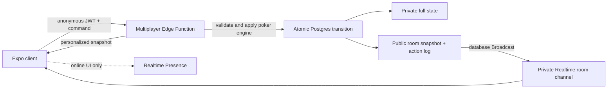

# Phase 9 — Private Multiplayer Tables

Status: implementation in progress.

Current checkpoint:

- The private-table entry, create/join setup, and lobby UI are feature-flagged
  and localized in English, Simplified Chinese, and Traditional Chinese.
- Slice 2's backend-shaped contracts, canonical coordinator, viewer redaction,
  idempotency, timeout, reconnect, AI takeover, and lobby command wiring are
  implemented with focused tests.
- The client intentionally stops before dealing. Canonical decks and private
  cards will be created only after Slice 3 moves the coordinator into a secured
  Edge Function.
- Tablet table seats, hole cards, avatars, stacks, and action badges now use a
  larger iPad-specific presentation while phone sizing remains unchanged.

## Goal

Let friends play the same RiverMind hand together, with RiverMind AI filling
any open seats, while preserving the app's calm learning UX, fair poker rules,
and no-account-first experience.

This phase introduces private play-money rooms. It does not turn RiverMind into
a public poker network or a real-money product.

## Product decisions

- A visible account is not required. RiverMind continues using a device-bound
  anonymous Supabase identity behind the scenes.
- A room supports 2, 3, or 6 total seats and any mix of human and AI players.
- At least one human must be seated; at least two occupied seats are required
  to begin.
- Friends join with a six-digit numeric room code or a shareable invite link.
- The host chooses the table size, starting stack, session length, turn timer,
  and which empty seats are filled by AI.
- The first release supports 5-hand, 10-hand, and open sessions with persistent
  stacks. A session also ends when only one player has chips.
- Coaching is disabled during live human play. Private post-hand review remains
  available and never reveals folded cards that were not shown down.
- All chips are virtual. There are no deposits, purchases, cash prizes, or
  cash-out mechanics.

## MVP scope

### Included

- Create a private room
- Join by room code, invite link, or a host-displayed QR code
- Choose a display name stored on the device
- Select an open seat and mark ready
- Add, remove, and configure AI seats before the game
- Start a mixed human/AI game
- Server-authoritative dealing, legal-action validation, AI decisions, pots,
  side pots, and showdowns
- Private Realtime room updates
- Turn timer, connection state, reconnect, and missed-action handling
- Continue through multiple hands and show a shared session result
- Personalized redacted hand history and post-hand review
- English, Simplified Chinese, and Traditional Chinese copy
- iPhone and iPad portrait/landscape support using the existing table system

### Deferred

- Public matchmaking and discoverable rooms
- Spectators or joining a table after play has started
- Text or voice chat and the moderation systems they require
- Cross-device identity recovery and history sync
- Friend lists, notifications, leagues, rankings, and public profiles
- Real-money wagering or an in-app chip economy
- Nine-player tables and additional poker variants
- Host migration controls beyond automatic lobby ownership transfer

## UX flow

### Entry from Play

Play gains a **Play with friends** card beside the existing solo modes.

```text
Play with friends
├── Create private table
└── Join with code
```

The existing AI game remains the fastest solo path. Multiplayer should never
add connection or lobby steps to solo play.

### Create room

The host sees one compact setup sheet:

| Setting | MVP choices | Recommended default |
| --- | --- | --- |
| Seats | 2, 3, 6 | 3 |
| Starting stack | 800, 2,000, 4,000 chips | 2,000 chips |
| Session | 5 hands, 10 hands, open | 10 hands |
| Turn time | 30, 45, 60 seconds | 45 seconds |
| AI level | Friendly, Club, Sharp | Club |

After creation, the room code and native share action are prominent, but the
code is not shown over the active table. **Share invite** opens a compact host
sheet with a QR code, the six-digit code, Copy, and the native Share action.
The QR contains the same room deep link as Share; the system camera handles
scanning, so the MVP does not need an in-app QR scanner. This surface is most
useful when the host is playing on iPad or showing the room from another screen.

Game-facing stacks, bets, calls, raises, and pots are always shown in chips.
Big-blind units are reserved for training, coaching, and other learning
contexts; they may be used internally by strategy code but are not part of the
multiplayer room contract or live-game presentation.

### Join room

Joining requires a six-digit numeric room code and display name. The app explains four states
directly in the form: invalid code, full room, game already started, and
connection unavailable. A successful join opens the lobby without another
confirmation screen.

### Lobby

The lobby uses the same felt table and seat positions as gameplay so players
understand where they will sit.

- A human selects any open seat.
- The host can turn an open seat into an AI seat or remove an AI.
- Human seats show **Ready**, **Not ready**, or **Offline**.
- AI seats show the existing identity, avatar, style, and difficulty.
- Start is enabled when every connected human is ready and at least two seats
  are occupied.
- If the lobby host leaves, ownership moves to the longest-present human.

### Live table

Each player always sees their own seat at the bottom, regardless of its
canonical table seat. The board, button, action order, stacks, and outcomes are
identical for everyone; only the viewing rotation and private hole cards differ.

The live table adds only three multiplayer-specific signals:

- a small connection indicator in the header;
- an action timer around the current human seat;
- **Offline** or **AI playing** on a temporarily controlled seat.

Network updates must not cause the table to jump, reset scroll position, flash
all cards, or replay actions that the user has already seen. Existing AI pacing
is reused to animate a server-produced batch of opponent actions in order.

## Authoritative architecture

The mobile client sends commands, never replacement game state. A server-side
game coordinator owns the deck, hidden cards, legal-action validation, AI
decisions, and canonical state version.



Realtime Presence is a visual hint, not game authority. Database timestamps and
room membership determine reconnect, timeout, and ownership behavior.

### Why the server is authoritative

- A client must never receive the undealt deck or another player's hidden
  cards.
- Two actions arriving together must not both be accepted.
- Reconnecting players need one canonical state.
- AI players must use only their own cards and public information.
- Future shared results and rankings require tamper-resistant hands.

### Command lifecycle

Every mutating command contains `roomId`, `commandId`, and `expectedVersion`.

1. The Edge Function verifies the caller's Supabase user JWT.
2. It verifies room membership, seat ownership, room status, turn, deadline,
   and legal action.
3. It loads the private canonical hand and applies the existing poker engine.
4. It processes consecutive AI turns in memory until another human must act or
   the hand finishes.
5. It atomically commits the transition only if the state version still equals
   `expectedVersion` and `commandId` has not already been accepted.
6. Postgres broadcasts a public transition to the private room topic.
7. The caller receives a viewer-specific projection containing public state,
   their own hole cards, and their legal actions.

If another command won the race, the function returns a stale-version response
and the client synchronizes instead of retrying the action blindly. Repeating a
successful `commandId` returns the original result, making poor connections and
double taps safe.

## Data boundaries

### Public, member-readable data

`multiplayer_rooms`

- room ID, lifecycle status, host user ID, configuration, current hand number,
  public snapshot, state version, turn deadline, and timestamps
- the join-code hash is never selectable by room members

`multiplayer_seats`

- room ID, canonical seat index, occupant type, human user ID or AI profile ID,
  display name, ready state, stack, control state, and last-seen timestamp

`multiplayer_actions`

- canonical action sequence, hand number, player/seat ID, action, public amount,
  resulting version, and server timestamp
- no deck, hidden card, private equity, or AI private reasoning fields

### Server-only data

`private.multiplayer_game_states`

- complete engine state, undealt deck, every hole card, AI state, and internal
  transition metadata
- unavailable through the Data API and accessible only to the game coordinator

### Viewer projection

The client model combines the latest public snapshot with:

- the viewer's player ID and canonical seat;
- only the viewer's current hole cards;
- current legal actions when it is the viewer's turn;
- connection and synchronization status.

Folded opponents' cards stay hidden permanently. At showdown, only eligible
players who reach showdown are revealed.

## Supabase security model

- Continue using `ensureAnonymousSession`; anonymous users receive authenticated
  JWTs but remain device-bound.
- Enable RLS on every exposed multiplayer table.
- Room and seat reads require an explicit membership predicate using
  `(select auth.uid())`; `TO authenticated` alone is not authorization.
- Clients cannot directly insert or update authoritative rooms, seats, actions,
  or private state.
- The Edge Function keeps platform JWT verification enabled and derives the
  caller from verified claims, never from a request-body user ID.
- The secret/service key exists only in the Edge Function.
- The atomic commit RPC uses invoker security and grants execute only to the
  server role; it is not a client API.
- Private Broadcast topics use membership-aware policies on
  `realtime.messages`.
- Room creation and join attempts are rate-limited. Six-digit numeric codes and
  their QR/deep-link form use a short expiry and are looked up only through the
  authenticated join endpoint; the invite is a convenience locator, not an
  authorization secret.
- Anonymous-auth abuse protection and scheduled cleanup are required before
  public release.
- Because new Supabase tables may not be exposed automatically, grants and Data
  API exposure are verified explicitly in the migration and release checks.

## Realtime and reconnect rules

- The room subscribes to a private `room:<room-id>` Broadcast channel.
- A Broadcast contains a state version, public snapshot, and ordered public
  actions. It never contains private cards.
- On subscribe, foreground, reconnect, version gap, or channel error, the
  client calls `sync` for a fresh viewer projection.
- Presence reports who appears online, but a missing Presence event cannot fold
  a player or transfer a seat.
- A 45-second timer is the default. The server's deadline is authoritative;
  the client clock is display-only.
- When a deadline passes, any connected member may send `tick`. The server
  rejects early ticks and applies check when legal, otherwise fold.
- Two consecutive missed decisions mark the human away. AI controls later
  decisions from that seat; the human can reclaim the seat between hands.
- If all humans are offline, the room pauses after resolving any already valid
  action. A later `sync` resumes from canonical state rather than simulating an
  unattended game.
- Leaving during a hand folds when necessary, then enables AI control so the
  remaining friends are not trapped.
- An anonymous player can reconnect on the same device. Reinstall and
  cross-device recovery remain unavailable until optional accounts are added.

## Mixed AI behavior

- AI identity is stored by profile ID, not inferred from its display name.
- AI decisions run in the same server coordinator as human actions.
- The existing fair-view adapter must be used so an AI receives its own cards
  and public state, never another seat's hidden information.
- A batch of consecutive AI actions is committed with the resulting canonical
  state. Clients animate the ordered actions using the existing readable table
  pacing instead of making the server sleep.
- AI takeover is visibly labeled and uses the room's configured difficulty.

## Required client refactor

The core multiway engine already supports arbitrary player IDs, but the current
screen and presentation helpers treat the local player as the literal `hero`
ID. Multiplayer requires viewer-relative presentation before networking is
added.

- Add `viewerPlayerId` to table, result, replay, coaching, and history helpers.
- Rotate canonical seats so each viewer is rendered at the bottom.
- Replace `game.players.hero` and string comparisons with viewer-aware helpers.
- Preserve `hero` as the solo adapter's player ID so existing AI modes and
  persisted hands remain compatible.
- Separate the table renderer from the current local solo controller.
- Add a local controller for AI games and a network controller for multiplayer;
  both feed the same viewer-ready table component.
- Move the pure cards, evaluator, multiway rules, and required AI logic into a
  shared TypeScript package consumed by Expo and the Edge Function. There must
  be one rules implementation, not a copied server version.

## Delivery slices

### Slice 1 — Viewer-relative table foundation

- Extract a shared table renderer and add `viewerPlayerId` throughout multiway
  presentation.
- Add 2-player placement to the multiway renderer.
- Keep every existing solo mode behavior and persistence format unchanged.
- Add deterministic tests proving two viewers see the same public state, their
  own cards at the bottom, and no unauthorized cards.

### Slice 2 — Local multiplayer state model

- Define room, seat, command, transition, public snapshot, and viewer snapshot
  contracts.
- Build a fake in-memory coordinator and use it to complete lobby and table UX
  without a live backend.
- Test stale versions, duplicate commands, action batching, and reconnect gaps.

### Slice 3 — Supabase rooms and security

- Add migrations, grants, RLS, private state, atomic transition RPC, Realtime
  authorization, and generated database types.
- Add authenticated create, join, lobby, start, sync, action, tick, and leave
  commands in one focused Edge Function.
- Run RLS/advisor checks and adversarial tests before connecting the app.

### Slice 4 — Live mixed-seat gameplay

- Connect lobby and table controllers to Supabase.
- Run AI turns server-side and animate action batches client-side.
- Complete timer, background/foreground, offline, takeover, reclaim, and host
  transfer behavior.

### Slice 5 — Learning, localization, and device quality

- Persist a viewer-redacted hand history and enable private post-hand review.
- Complete English, Simplified Chinese, and Traditional Chinese copy.
- Test the smallest supported iPhone, six-player phone landscape, iPad portrait,
  iPad landscape, Dynamic Type, VoiceOver labels, and reduced motion.

### Slice 6 — Reliability and beta release

- Add coordinator unit tests, local Supabase integration tests, two-simulator
  end-to-end tests, reconnect/fault injection, and concurrency tests.
- Verify no response, log, Broadcast, persistence row, diagnostic, or crash
  report leaks hidden cards or secrets.
- Add room/action metrics without player card data.
- Release first to an internal TestFlight group before enabling the feature for
  every beta user.

## Acceptance criteria

- Two physical devices can join by code, select seats, ready up, and complete a
  multi-hand session with matching board, pots, stacks, action order, and result.
- Any remaining seats can be filled by AI without changing the human flow.
- Simultaneous, repeated, late, unauthorized, and illegal commands cannot
  corrupt state or act for another player.
- No client or member-readable database record can access the deck or another
  player's hidden cards.
- A backgrounded client can return to the correct version and act without
  restarting the room.
- A disconnected player cannot permanently stall the table.
- Solo AI games, tournaments, learning missions, history, and coaching remain
  behaviorally compatible.
- The table remains readable and action controls stay reachable across supported
  iPhone and iPad layouts in all three languages.

## Next implementation step

Finish Slice 1's viewer-relative table/controller boundary, then begin Slice 3:
move the tested coordinator behind an authenticated Edge Function and add the
private state, RLS, grants, atomic transition, and Realtime policies. Do not
connect live client dealing before hidden-card redaction and concurrency checks
pass against local Supabase.
